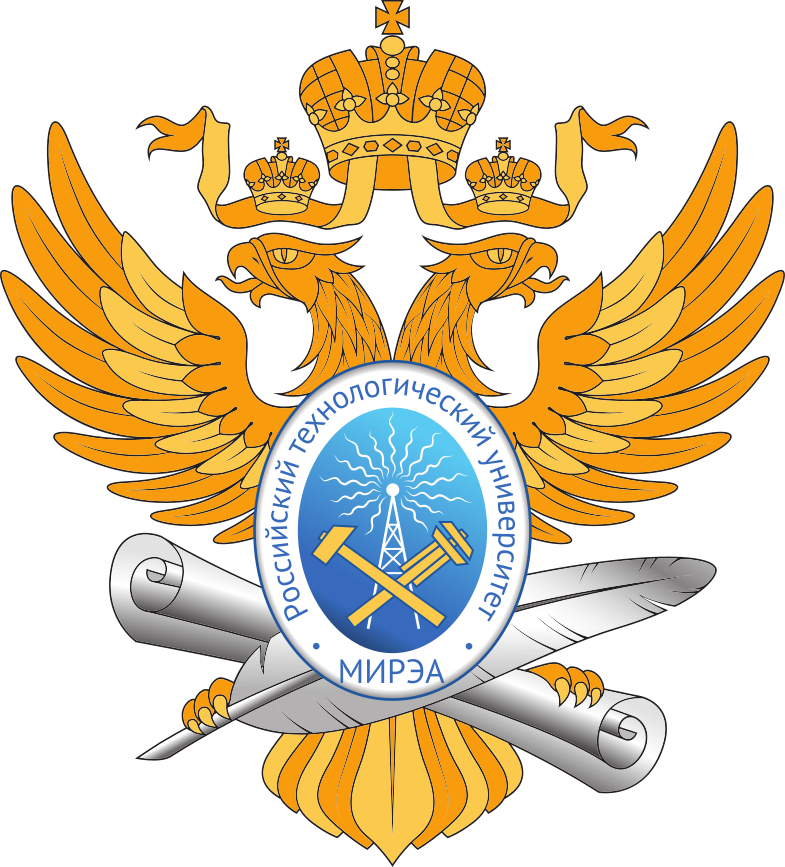

  

___

# Программирование корпоративных систем
Дисциплина: **Программирование корпоративных систем**  
Семестр: 5  
Работы выполнил студент **ЭФБО-01-22 Петров Павел Константинович**  

# Структура репозитория
| Номер Практики | Ссылка на ветку |
|:---:|---|
| 1 | [Ссылка на ветку](https://github.com/vedrent/flutter-task1) |
| 2 | [Ссылка на ветку](https://github.com/vedrent/flutter-task2) |
| 3 | [Ссылка на ветку](https://github.com/vedrent/flutter-task3) |
| 4 | [Ссылка на ветку](https://github.com/vedrent/flutter-task4) |
| 5 | [Ссылка на ветку](https://github.com/vedrent/flutter-tasks/tree/task-5) |
| 6 | [Ссылка на ветку](https://github.com/vedrent/flutter-tasks/tree/task-6) |
| 7 | [Ссылка на ветку](https://github.com/vedrent/flutter-tasks/tree/task-7) |
| 8 | [Ссылка на ветку](https://github.com/vedrent/flutter-tasks/tree/task-8) |
| 9 | [Ссылка на ветку](https://github.com/vedrent/flutter-tasks/tree/task-9) |
| 10 | [Ссылка на ветку](https://github.com/vedrent/flutter-tasks/tree/task-10) |
| 11 | [Ссылка на ветку](https://github.com/vedrent/flutter-tasks/tree/task-11) |
| 12 | [Ссылка на ветку](https://github.com/vedrent/flutter-tasks/tree/task-12) |
| 13 | [Ссылка на ветку](https://github.com/vedrent/flutter-tasks/tree/task-13) |
| 14 | [Ссылка на ветку](https://github.com/vedrent/flutter-tasks/tree/task-14) |
| 15 | [Ссылка на ветку](https://github.com/vedrent/flutter-tasks/tree/task-15) |
| 16 | [Ссылка на ветку](https://github.com/vedrent/flutter-tasks/tree/task-16) |
